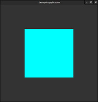
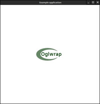
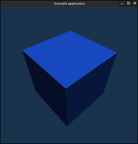

Oglwrap examples
================

[01_square.cpp](src/cpp/01_square.cpp)
--------------------------------------

[02_textured_square.cpp](src/cpp/02_textured_square.cpp)
--------------------------------------

[03_cube.cpp](src/cpp/03_cube.cpp)
--------------------------------------

